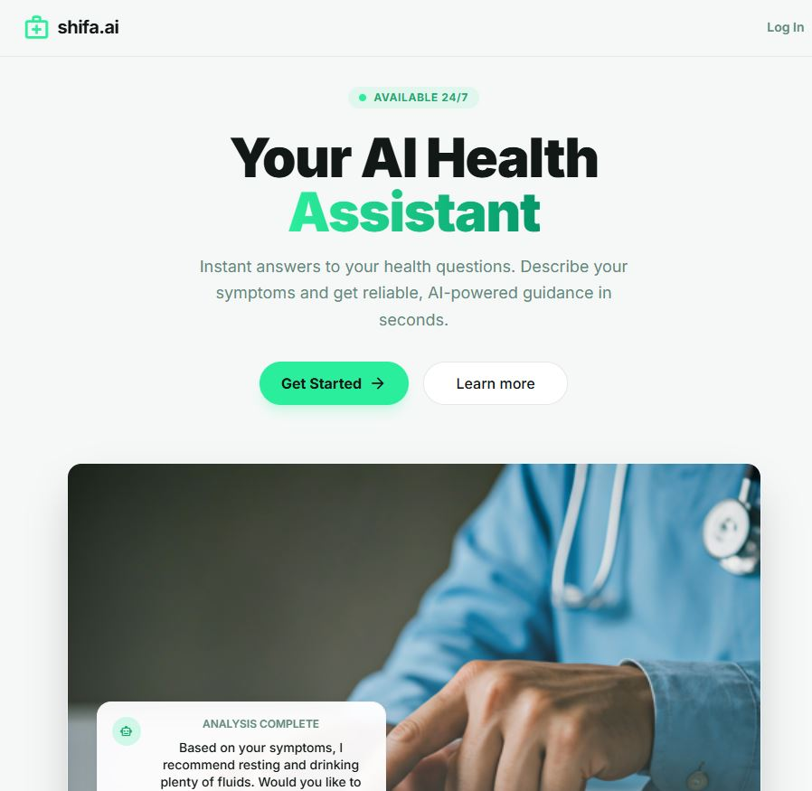

# shifa.ai - AI Health Assistant

A production-ready MVP for an AI-powered health assistant using FastAPI, SQLAlchemy (SQLite), and Google Gemini Pro.

## 🚀 Preview



> A clean, modern interface designed for clarity, trust, and usability.


## Features
- **Modern UI**: Clean, responsive design with dark mode support.
- **User Onboarding**: Simple flow to collect basic user info.
- **AI Chat**: Powered by Google Gemini Pro with health-specific guardrails.
- **Chat History**: Messages are saved and reloaded automatically.
- **Usage Limits**: Configurable limit on free questions (default: 10).

## Tech Stack
- **Backend**: Python 3.9+, FastAPI, SQLAlchemy, SQLite, Google Generative AI Python SDK.
- **Frontend**: Tailwind CSS (CDN), Material Symbols, Vanilla JavaScript.

## Setup

1. **Clone the project**
2. **Create a virtual environment**:
   **Windows**:
   ```powershell
   python -m venv venv
   venv\Scripts\activate
   ```

   **macOS/Linux**:
   ```bash
   python3 -m venv venv
   source venv/bin/activate
   ```
3. **Install dependencies**:
   ```bash
   pip install -r requirements.txt
   ```
4. **Configure Environment Variables**:
   Update the `.env` file with your Gemini API Key:
   ```env
   GEMINI_API_KEY=your_actual_api_key_here
   ```

## Running the Project

Start the server using `uvicorn`:

```bash
uvicorn backend.main:app --reload
```

The application will be available at [http://127.0.0.1:8000](http://127.0.0.1:8000).

---

### Folder Structure
- `backend/`: FastAPI application code.
- `frontend/`: Static HTML/JS files.
- `shifa.db`: SQLite database file (generated on first run).


## 👨‍💻 Meet the Developer

Hi, I'm **Hassan Khan** 👋  
**AI Engineer | RAG Systems | LLM Chatbots | AI Agents**

I build **production-grade AI systems** that help businesses:
- RAG Systems, Custom LLM Chatbots, AI Agents, Python based AI Backends
- Chat with their private data  
- Automate workflows  
- Deploy scalable, reliable AI solutions  

---

## 🤝 Let’s Connect

📧 **Email**: hassanaiengineer@gmail.com  
🔗 **LinkedIn**: https://www.linkedin.com/in/hassan-khan-4961b722b/  
🔗 **Upwork**: https://www.upwork.com/freelancers/~016ca6a619d9683838  
